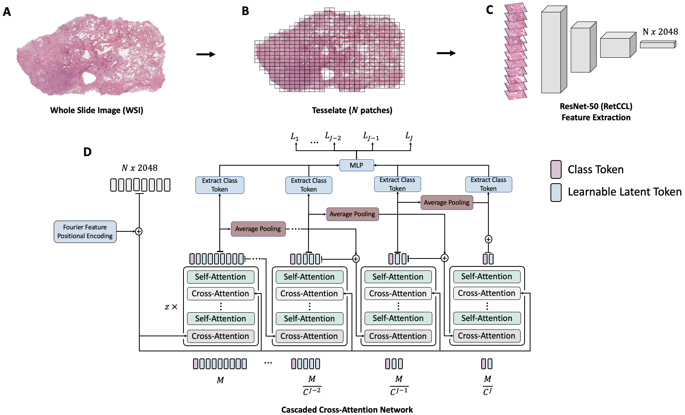

Cascaded Cross-Attention Networks for Data-Efficient Whole-Slide Image Classification Using Transformers
=========================

This repository contains the code to our corresponding publication "Cascaded Cross-Attention Networks for Data-Efficient Whole-Slide Image Classification Using Transformers". In detail, it includes the code for the cascaded cross-attenion networks and the script for training the model as well as logging results (such as the area under the receiver operator characteristic curve) on [weights and biases](https://wandb.ai)

- [Springer Proceedings](https://link.springer.com/chapter/10.1007/978-3-031-45676-3_42)
- [Arxiv](https://arxiv.org/abs/2305.06963)




# System Requirements
This code has been tested on Ubuntu 20.04 and an NVIDIA Quadro RTX A6000 GPU. Furthermore it was developed using Python v3.8.

# Setup

In order to run this model, please download the TCGA-NSCLC dataset (i.e., the TCGA-LUAD and TCGA-LUSC) as well as the TCGA-RCC (i.e., the TCGA-KIRC, TCGA-KICH and TCGA-KIRP) from https://portal.gdc.cancer.gov/ and extract the features using the following repositories:

- To extract tiles: https://github.com/KatherLab/preprocessing-ng
- To extract features from the tiles: https://github.com/KatherLab/marugoto

In our setting, we store all the features in a folder called TCGA_features (i.e., .../TCGA_RCC/TCGA_features and .../TCGA_NSCLC/TCGA_features).
Next, create a set of training folds. In our environment, we store the folds in a folder called "folds" using csv's (i.e., .../TCGA_RCC/folds/fold_0.csv, .../TCGA_RCC/folds/fold_1.csv ...) where each CSV contains a column 'FileName' which links to the features of a specific sample (e.g., TCGA-98-A53C-01Z-00-DX1.1E06B7B5-32C3-436C-AD66-27E5829ADA85.h5), a column 'subtype', which denotes the cancer subtype (i.e., LUSC or LUAD for TCGA-NSCLC and KICH, KIRP or KIRC for TCGA-RCC) and a column 'split' denoting whether the sample is assigned to train, val or test:

Example for adopted folder structure:
```
.
├── folds
│ ├── fold_0.csv
│ ├── fold_1.csv
│ ├── fold_2.csv
│ ├── fold_3.csv
│ 
├── TCGA_features
│ ├── TCGA-AK-3429-01Z-00-DX1.3501F4D9-4764-4D30-A5BC-B0FF1A494CFE.h5
│ ├── TCGA-B0-5709-01Z-00-DX1.8e4b701a-1ef7-4d79-a562-0f316c696984.h5
│ ├── TCGA-BP-4768-01Z-00-DX1.f56632b8-79d2-440d-a137-b9f667e4ef54.h5
│ ├── TCGA-CJ-4643-01Z-00-DX1.50F38125-1825-4B66-A171-4C92279E306D.h5
│ ├── ...
```

Example for fold_x.csv
```
|                             FileName                            | subtype  | split |
|-----------------------------------------------------------------|----------|-------|
| TCGA-B1-7332-01Z-00-DX1.a04eb9f5-6b35-4877-8b54-f675fab63925.h5 |   KIRP   | train |
| TCGA-BP-4165-01Z-00-DX1.1f8b54d9-1285-4226-a8f4-1ad789cd48c5.h5 |   KIRC   | val   |
| TCGA-B0-4698-01Z-00-DX1.e50fd25d-db5f-419f-b400-911fce1333d0.h5 |   KIRC   | train |
| TCGA-A3-3357-01Z-00-DX1.b85a8293-7b4f-4a8a-b799-77d7d7b39b3e.h5 |   KICH   | val   |
| TCGA-HE-A5NL-01Z-00-DX1.913399D7-F66A-4163-8D98-494CFAA600EC.h5 |   KIRP   | test  |
| ...
```


Additionally, create a virtual environment (e.g. with conda):
````
conda create -n cascaded_cross_attention python=3.8
````
and run 
```
conda activate cascaded_cross_attention
```
followed by
```
pip install -r requirements.txt
```
to download and install the required dependencies. 

Next, to run the code we have to set up the necessary paths. Configuration management is done with using [Hydra](https://hydra.cc/) and therefore can be set up as command arguments in the training runs below or directly in the config files.

Navigate to ./classification/config/dataset/tcga_nsclc.yaml and set the path for the TCGA-NSCLC dataset (i.e., the folder that contains the subfolders for the TCGA_features and folds for the TCGA-NSCLC dataset) under root_path and repeat the same step for the TCGA-RCC by adapting the config file under ./classification/config/dataset/tcga_rcc.yaml. Moreover, under ./classification/config/base_cfg.yaml modify the output_dir key to match the location of your desired output directory for the model checkpoints.

Note: The results of the training runs will be logged on weights and biases. 

# Training
Once everything is set up, run the follow commands to train the model.

To train the model on TCGA-NSCLC run the following command:

```
python classification/training/trainer.py dataset=tcga_nsclc optimizer.lr=6e-5 model.output_logits=1 model=cat_explainable meta.prefix_name=tcga_nsclc_cat_explainable epochs=50 meta.batch_size=30 meta.cross_validation=True meta.num_workers=10 meta.gpus=[0] meta.imbalance_handler=None optimizer.name=AdamW model.meta.depth=6 model.meta.deep_supervision=True model.meta.feats_module.use_skip_connection=True model.meta.use_dropout=True model.meta.p_do=0.9 model.meta.cat_module.latent_dim=128 model.meta.cat_module.cross_heads=3 model.meta.cat_module.latent_dim=512 model.meta.cat_module.self_per_cross_attn=2
```

Next, to train the model on TCGA-RCC run the following command:
```
python classification/training/trainer.py dataset=tcga_rcc optimizer.lr=6e-5 model.output_logits=3 model=cat_explainable meta.prefix_name=tcga_rcc_cat_explainable epochs=50 meta.batch_size=30 meta.cross_validation=True meta.num_workers=10 meta.gpus=[0] meta.imbalance_handler=None optimizer.name=AdamW model.meta.depth=6 model.meta.deep_supervision=True model.meta.feats_module.use_skip_connection=True model.meta.use_dropout=True model.meta.p_do=0.9 model.meta.cat_module.latent_dim=128 model.meta.cat_module.cross_heads=3 model.meta.cat_module.latent_dim=512 model.meta.cat_module.self_per_cross_attn=2
```

# Visualizing Attention Heatmaps
To visualize attention heatmaps, adapt the jupyter-notebook under ./evaluation/generate_heatmaps.ipynb

# Citation
To cite our work, please use
```bibtex
@inproceedings{khader_cascaded_2024,
	title = {Cascaded {Cross}-{Attention} {Networks} for {Data}-{Efficient} {Whole}-{Slide} {Image} {Classification} {Using} {Transformers}},
	isbn = {978-3-031-45676-3},
	booktitle = {Machine {Learning} in {Medical} {Imaging}},
	publisher = {Springer Nature Switzerland},
	author = {Khader, Firas and Kather, Jakob Nikolas and Han, Tianyu and Nebelung, Sven and Kuhl, Christiane and Stegmaier, Johannes and Truhn, Daniel},
	year = {2024},
	pages = {417--426},
}
```


